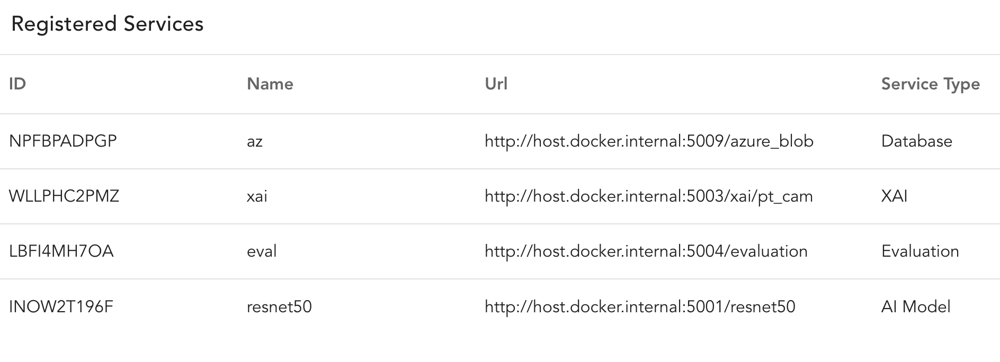
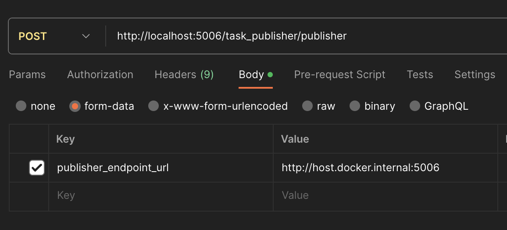
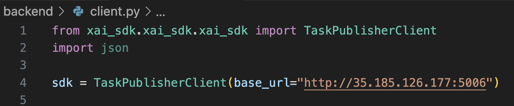
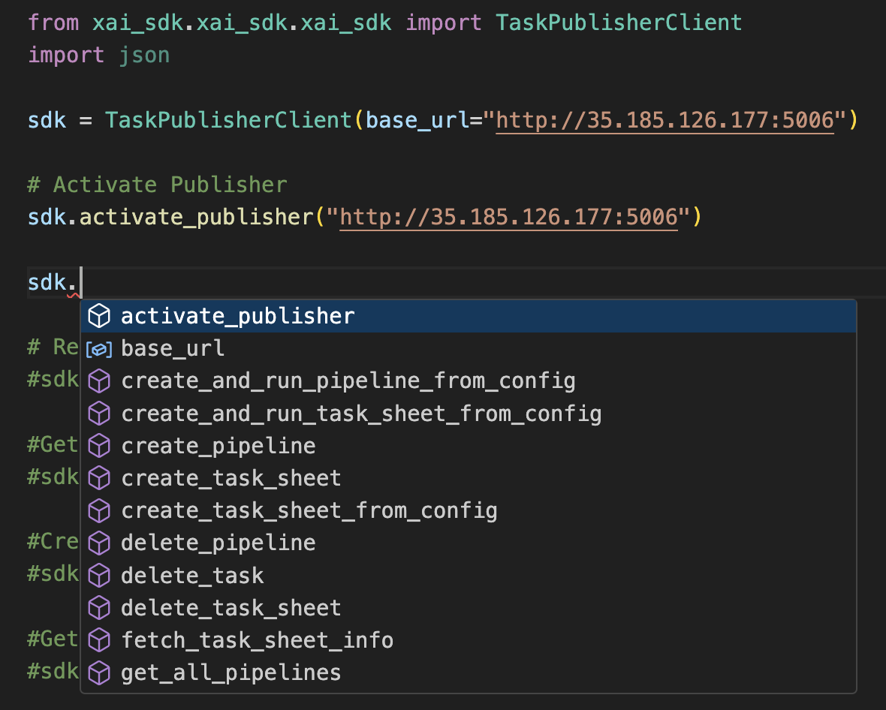
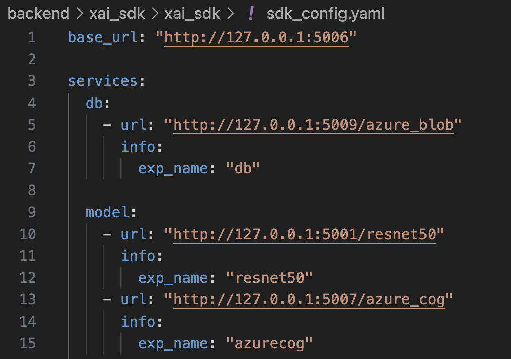

## Important Update

1. `az_blob_connection_str.json` and `mongo.*.conf` are no longer required. All configuration goes to `.env.dev` or `.end.pred.` For instance, the following environment variables are required:

   ```properties
   ENV=dev
   MONGO_CONF_STR=
   AZ_BLOB_STR=
   ```

2. For the frontend:

   Make sure you have the `.env` file in `frontend-x`:

   ```properties
   VITE_ENV=dev
   VITE_BASE_URL=http://127.0.0.1:5006/
   ```

## Local Dev with Flask

Before you start, please have your `.env.dev` file ready with the required environment variables.

1. Start mongo container

   ```bash
   docker compose -f ./backend/docker-compose.yml -f ./backend/docker-compose-dev.yml --project-directory . up mongo --build
   ```

2. Start Central:

   ```bash
   pip install -q backend/central_dev/. && flask --app 'backend/central:create_app("dev")' run -p 5006
   ```

3. Start Azure blob service

   ```bash
   flask --app backend/db_service/azure_blob run -p 5009
   ```

4. Start ResNet50:

   ```bash
   flask --app backend/model_service/resnet50 run -p 5001
   ```

5. Start Grad-CAM XAI:

   ```bash
   flask --app 'backend/xai_service/pytorch_cam:create_app(cam_method="grad-cam")' run -p 5003
   ```

6. Start Eval Service:

   ```bash
   flask --app backend/evaluation_service run -p 5004
   ```

7. Start Frontend:

   ```bash
   docker compose -f frontend-x/docker-compose.yml --project-directory . -p frontend up fex --build
   ```

Check this link for API and use case:

https://www.postman.com/youyinnn/workspace/concordia/collection/2019955-72d3c5f3-2070-4bba-97de-d5990085b20e?action=share&creator=2019955&active-environment=2019955-c8be28eb-2739-48db-89b7-a74fc752029c

1. activate the central;
2. register db, xai, model, evaluation service;
3. create xai tasksheet, available config for demo:
   ```json
   {
     "method_name": "grad-cam",
     "data_set_name": "imagenet1000",
     "data_set_group_name": "g0",
     "model_name": "resnet50",
     "executor_config": {
       "use_pytorch_multiprocess": true
     }
   }
   ```
4. run the task;
5. check the result;

## Local Dev with Docker and Docker-compose

Before you start, make sure (1) the `.env.dev` is ready and (2) you are in the location of the project root.

```bash
docker compose -f ./backend/docker-compose.yml -f ./backend/docker-compose-dev.yml --project-directory . up
```

If you want to push your changes to the docker image, use

```bash
docker compose -f ./backend/docker-compose.yml -f ./backend/docker-compose-dev.yml --project-directory . up --build
```

Then:

Please use http://host.docker.internal` to replace all `localhost` or `127.0.0.1` for your service registration and demonstration. For instance:



and



If you want to build a single service:

```bash
docker build . -f ./backend/central/Dockerfile -t central
```

## XAI-Services Using SDK

Before running the services using the SDK, you need to create a ```client.py``` and import ```TaskPublisherClient``` from the SDK and activate it as shown below.



Now, you can call the XAI-Services using 'sdk.service_name' as shown below and run the python file using the command 

```bash 
python3 client.py
```



Users can configure their services as per their requirement using the 'sdk_config.yaml' file located in the SDK Package at ```backend/xai_sdk/xai_sdk/sdk_config.yaml```


